#### Castel Maxence
#### H2
##### Creation automatique des tables oui

#### POINTS FAITS

### Les endpoitns sont dans AuteurController et HomeController

##### /activer dans AuteurController

## Q8
### Tables créées par JPA et isert dans DemoApplication void run
### Creation des user et admin dans import.sql
### Restriction dans Security.java

## Q5
### Page responsives

# ----------------
# CORRECTION
# ----------------

## Introduction

### Tout ce que j'ai mis en commentaire suite à la correction est en commentaire 2 fois (## ou // //)

### Suppression des entités, repository et controllers qui ne servent à rien pour éviter de se perdre, afficher des erreurs ou requêtes sql qui n'ont aucun rapport (à part livre et auteur qui servent de référence)

### Pour corriger le projet, depuis chez moi, je préfère utiliser mysql pour bien visualiser la base de données et voir les relations

### J'ai créé un controlleur pour chaque entité pour respecter la structure MVC. Lors du CTP j'avais tout mis dans le même controlleur pour aller plus vite 

### J'ai préparé le projet avec de la securité sur JDBC, cela fonctionne, j'ai laissé comme cela pour ne pas perdre de temps et eviter tout erreur suite au changement de configuration

### J'ai laissé la configuration de H2 et rajouté Postgresql en commentaire si vous souhaitez tester avec H2 ou Postgresql

## Questions

### Q1. Réalisez un endpoint /activer permettant d’afficher un formulaire avec la liste des questions de la base et qui permet d’activer une de ces questions en mode exclusif (radio). On veillera à désactiver toute autre question de manière à ce qu’une seule soit activée à la fois et à mettre tous les nbChoix correspondants à zéro. Une fois la question choisie on affichera un simple message récapitulatif disant "La question xxxxx vient d’être activée".

listeQuest (/activer en GET) dans QuestionController 
- Affiche la liste des questions de la base 
- Formulaire pour activer/desactiver et voir une question
- Formulaire pour activer/voir une question qui n'existe pas en base (pour tester erreur)

```java
@GetMapping("/activer")
private String listeQuest(ModelMap modelMap){
    modelMap.put("questions",questionRepository.findAll());
    return "listeQuest";
}
```

activerQuestion (/activer en POST) dans QuestionController
- Permet d'activer une question
- Appelée depuis /activer en GET
- Gestion des erreurs (activer question qui n'existe pas en base)

```java
@PostMapping("/activer")
public String activerQuestion(@RequestParam int questionNum, ModelMap modelMap, Principal principal) {
    Optional<Question> questionToActiveOpt = questionRepository.findById(questionNum);

    List<Question> questions = questionRepository.findAll();

    if (!questionToActiveOpt.isPresent()) {
        modelMap.put("error", "La question numéro " + questionNum + " n'existe pas");
        modelMap.put("questions", questions);
        return "listeQuest";
    }
    
    for (Question question : questions) {
        question.setActive(false);
        for (Choix choix : question.getChoix()) {
            choix.setNbChoix(0);
            choixRepository.save(choix);
        }
        questionRepository.save(question); 
    }
    
    Question questionToActive = questionToActiveOpt.get();
    questionToActive.setActive(true);
    questionRepository.save(questionToActive);

    Authentication auth = SecurityContextHolder.getContext().getAuthentication();
    String loguedUserName = auth.getName();

    modelMap.addAttribute("loguedUserName", loguedUserName);
    modelMap.addAttribute("userViaPrincipal", principal.getName());
    modelMap.put("questions", questionRepository.findAll());
    modelMap.put("message", "La question <b>" + questionToActive.getLibelle() + "</b> vient d'être activée");

    return "listeQuest";
}
```

(Bonus) desactiverQuestion (/desactiver en POST) dans QuestionController
- Permet de désactiver une question
- Appelée depuis /activer en GET

```java
@PostMapping("/desactiver")
public String desactiverQuestion(@RequestParam int questionNum, RedirectAttributes redirectAttributes) {
    Optional<Question> questionToDesactiveOpt = questionRepository.findById(questionNum);

    List<Question> questions = questionRepository.findAll();

    if (!questionToDesactiveOpt.isPresent()) {
        redirectAttributes.addFlashAttribute("error", "La question numéro " + questionNum + " n'existe pas");
        return "redirect:/activer";
    }
    
    for (Question question : questions) {
        question.setActive(false);
        for (Choix choix : question.getChoix()) {
            choix.setNbChoix(0);
            choixRepository.save(choix);
        }
        questionRepository.save(question); 
    }

    redirectAttributes.addFlashAttribute("message", "La question <b>" + questionToDesactiveOpt.get().getLibelle() + "</b> vient d'être désactivée");

    return "redirect:/activer";
}
```

Liste des questions : 

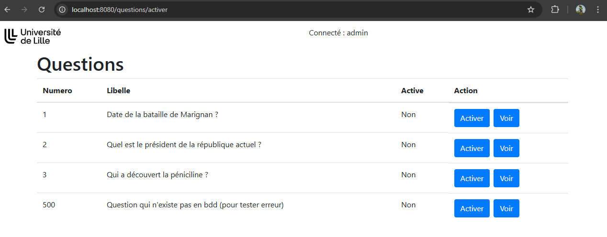 

Activer une question :

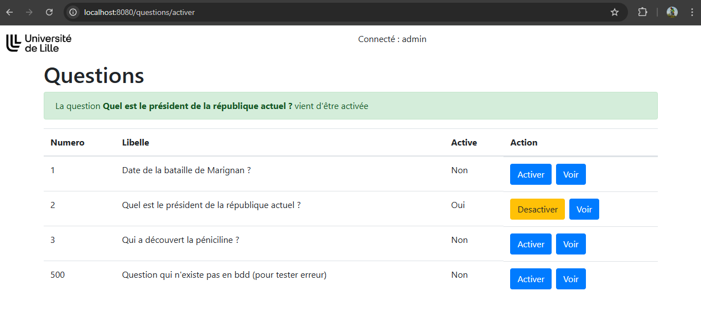

Desactiver une question :

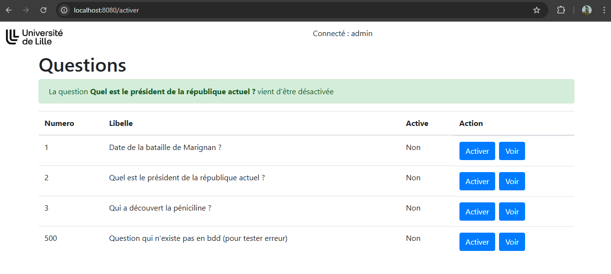 

Activer une question qui n'existe pas en base :

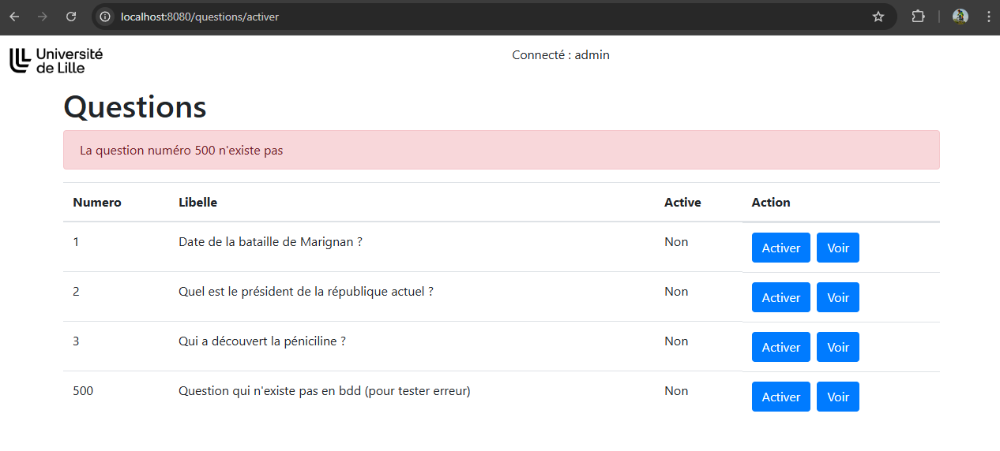


### Q2. Réalisez un endpoint /voter qui affiche en titre la question courante et dans un formulaire la liste des choix possibles en mode exclusif (radio). La sélection d’un des choix incrémentera le compteur nbChoix correspondant dans la base. Une fois validé on affichera un simple message récapitulatif "Votre choix a bien été pris en compte". 

showQuestion (/voter en GET) dans QuestionController
- Affiche la question active en titre
- Affiche un formulaire avec la liste des choix de la question

```java
@GetMapping("/voter")
private String showQuestion(ModelMap modelMap){
    Optional<Question> questionActiveOpt = questionRepository.findByActive(true);
    
    if (!questionActiveOpt.isPresent()) {
        modelMap.put("error", "Aucune question active");
        return "voter";
    }

    Question questionActive = questionActiveOpt.get();

    Optional<Choix> choixFromNotActiveQuestOpt = choixRepository.findFirstByQuestionNot(questionActive);
    
    if (!choixFromNotActiveQuestOpt.isPresent()) {
        modelMap.put("error", "Ce choix n'existe pas");
        return "voter";
    }

    modelMap.put("question", questionActive);
    modelMap.put("choix", questionActive.getChoix());
    modelMap.put("choixFromNotActiveQuest", choixFromNotActiveQuestOpt.get());

    return "voter";
}
```

voteQuestion (/voter en POST) dans QuestionController
- Permet d'incrementer le compteur nbChoix d'un choix
- Affiche un message après vote
- Appelée depuis /voter en GET
- Gestion des erreurs (voter avec un choix qui nexiste pas en base ou qui n'appartient pas à la question)

```java
@PostMapping("/voter")
private String voteQuestion(@RequestParam int questionNum, @RequestParam int choixNum, ModelMap modelMap){
    Optional<Question> questionVoteOpt = questionRepository.findById(questionNum);

    if (!questionVoteOpt.isPresent()) {
        modelMap.put("error", "La question numéro " + questionNum + " n'existe pas");
        return "voter";
    }

    Question questionVote = questionVoteOpt.get();
    
    if (!questionVote.isActive()) {
        modelMap.put("error", "La question <b>" + questionVote.getLibelle() + "</b> n'est plus active");
        return "voter";
    }
    
    List<Choix> questionVoteChoix = questionVote.getChoix();

    Optional<Choix> userChoixOpt = choixRepository.findById(choixNum);
    if (!userChoixOpt.isPresent()) {
        modelMap.put("error", "Le choix numéro " + choixNum + " n'existe pas");
        return "voter";
    }

    Choix userChoix = userChoixOpt.get();

    if (!questionVoteChoix.contains(userChoix)) {
        modelMap.put("error", "Ce choix n'appartient pas à cette question");
        return "voter";
    }

    userChoix.setNbChoix(userChoix.getNbChoix() + 1);
    choixRepository.save(userChoix);

    modelMap.put("message", "Votre choix a bien été pris en compte !");
    return "voter";
}
```

Affiche la question active :

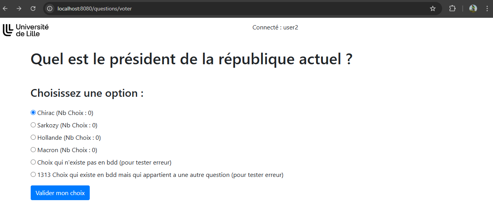  

Voter :

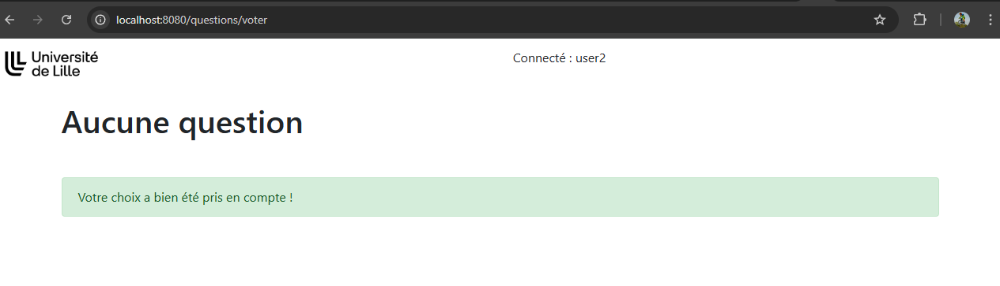

Compteur incrémenté après vote :


Voter avec un choix qui n'existe pas en base :

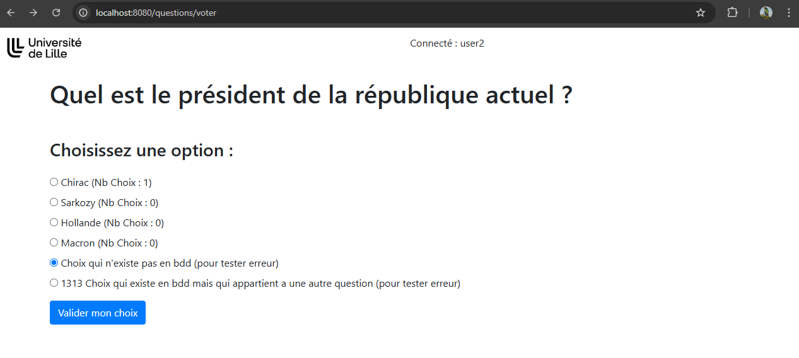
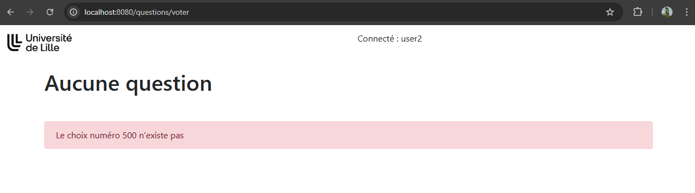 

Voter avec un choix qui n'appartient pas à la question :

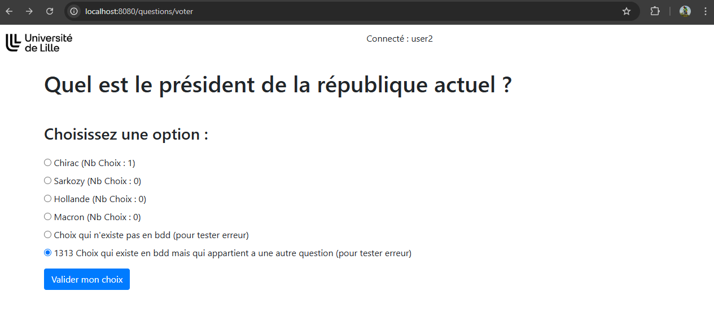
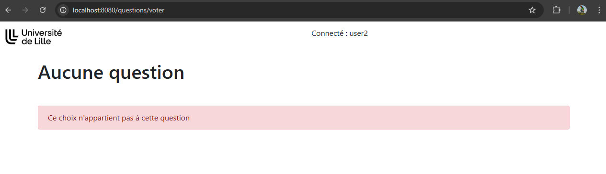

### Q3. Réalisez un endpoint /voir qui permet d’afficher en titre la question et en liste à points les différents choix avec leurs nombre de réponses respectifs. 
### Q4. Ajoutez à la visualisation précédente le pourcentage de votes corrects sur le nombre de votants. 

voirQuestion (/voir en GET) dans QuestionController
- Affiche une question et ses choix
- Pour chaque choix affiche le nombre de votes
- Affiche le nombre de votants
- Affiche le pourcentage de votes corrects sur le nombre de votants

```java
@GetMapping("/voir")
private String voirQuestion(@RequestParam int questionNum, ModelMap modelMap) {
    Optional<Question> questionOpt = questionRepository.findById(questionNum);

    if (!questionOpt.isPresent()) {
        modelMap.put("error", "La question n'existe pas");
        return "voir"; 
    }

    int nbVotesTotal = 0;
    int nbVotesCorrectTotal = 0;

    Question question = questionOpt.get();
    List<Choix> choix = question.getChoix();

    for (Choix c : choix) {
        nbVotesTotal += c.getNbChoix();
        if (c.isStatut()) {
            nbVotesCorrectTotal += c.getNbChoix();
        }
    }

    Double percentageCorrect = 0.0;
    if (nbVotesTotal > 0) {
        percentageCorrect = (double) nbVotesCorrectTotal / nbVotesTotal  * 100;
    } 

    modelMap.put("question", question);
    modelMap.put("choix", choix);
    modelMap.put("nbVotesTotal", nbVotesTotal);
    modelMap.put("percentageCorrect", percentageCorrect);

    return "voir";
}
```

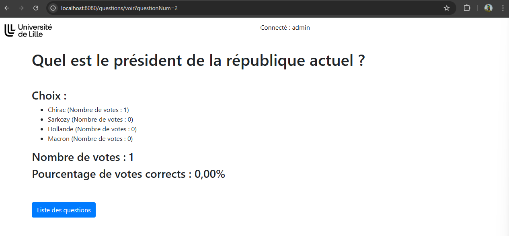 

### Q5. Faire en sorte que les pages précédentes soient présentées dans un mode "responsive design" (avec Bootstrap ou autre) permettant de le faire fonctionner sur téléphone portable. On mettra en haut de chaque page le logo de l’université. 

fait voir captures écrans précédentes

### Q6. Mettre en place un système d’authentification avec 2 rôles : admin et user. On pourra utiliser la configuration par défaut et les tables par défaut offertes par Spring. On créera directement dans le code quatre utilisateurs : un utilisateur de rôle admin nommé admin/admin. Trois utilisateurs de rôle user nommés user1/user1, user2/user2, user3/user3. On pourra conserver le formulaire de login/mdp classique de SpringSecurity. Les url /activer et /voir ne seront accessibles qu’au rôle admin. Le endpoint /voter ne sera accessible qu’au rôle user. Les mots de passe seront chiffrés en bcrypt. 

fait voir captures écran précédentes
- tables users et authorities créées dans `schema.sql`
- 3 utilisateurs de rôle user user1/user1, user2/user2, user3/user3 et 1 utilisateur de rôle admin admin/admin créés dans `import.sql`

`Security.java` : 

```java	
@Bean
    public SecurityFilterChain mesautorisations(HttpSecurity http, HandlerMappingIntrospector introspector)
            throws Exception {
        return http
                .authorizeHttpRequests((authorize) -> authorize
                        .requestMatchers("/questions/activer").hasAuthority("ADMIN")
                        .requestMatchers("/questions/desactiver").hasAuthority("ADMIN")
                        .requestMatchers("/questions/voir").hasAuthority("ADMIN")
                        .requestMatchers("/questions/voter").hasAuthority("USER")
                        .requestMatchers("/h2-console/**").permitAll()
                        .anyRequest().permitAll()
                )
                .headers( headers -> headers.frameOptions(FrameOptionsConfig::sameOrigin) )
                .formLogin(Customizer.withDefaults())
                .rememberMe(configurer -> configurer.rememberMeParameter("remember")
                        .useSecureCookie(true))
                .csrf().disable()
                .build();
    }
```

### Q7. Mettre en haut de toutes les pages précédemment créées le nom de la personne connectée. 

fait voir captures écran précédentes

### Q8. Faire en sorte que les tables soient automatiquement créées et remplies dès le lancement de l’application. Les tables seront créées par JPA (mode create) et les données importées par import.sql. On doit pouvoir lancer l’application avec mvn springboot:run et avoir directement un fonctionnement par défaut avec les quelques questions/réponses fournies et les 3 utilisateurs.

- Les entités sont dans `src/main/java/fr/but3/revision/models`
- Les tables sont automatiquement créées par JPA au lancement de l’application 
    - `application.properties` : 
        - spring.jpa.hibernate.ddl-auto=create
        - spring.sql.init.mode=always
    - Tables users et authorities créées dans `schema.sql`
    - Données dans `import.sql`
    - Lancement de l’application : `mvn springboot:run`